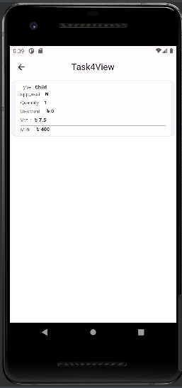

# Babuland_APP

Project Name : Babuland App.
Dart Version : 2.19.6
Flutter Version : 3.7.11

## Getting Started

- State management >>  Getx
- flutter architecture >> Get CLI Format

  list of technologies and libraries used
    - http:
    - coupon_uikit: ^4.6.1
    - shimmer: ^2.13.0
    - get: ^4.6.5

A few resources to get :

- [Project APK ](https://drive.google.com/file/d/140EYXfQabfM4YfobLPWm07sM-OWQvlXx/view?usp=drive_link)
- [Project Source Code](https://drive.google.com/drive/folders/13ma7If_546g02hZ-CwI8OURZlS3NrhiH?usp=drive_link)
- [Project ScreenShort](https://drive.google.com/drive/folders/1lOdqivJYLh87lPG9l8N__5jjAcGp0DvL?usp=drive_link)

# Screenshot

If you have any questions, please feel free to contact us.
Engr. Md.adnan Morshed
Software engineer
mail : adnanmorshed118@gmail.com
Mobile : 01831679008
